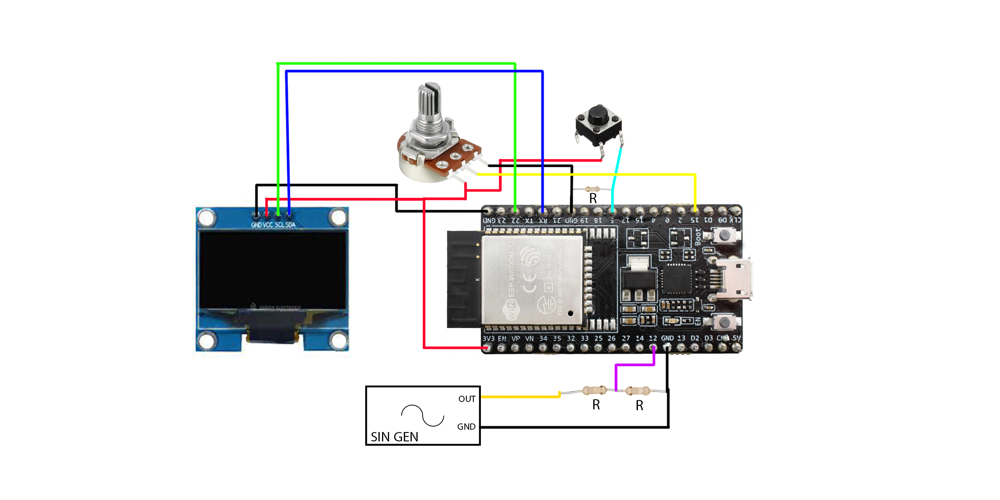

# ⚡ DIY ESP32 Oscilloscope

A compact oscilloscope built with an **ESP32**, an **SSD1306 OLED display**, a **potentiometer**, and a **push button** — all running in real time!  
This project visualizes analog signals directly on the OLED and includes multiple modes such as time/amplitude control, cursor measurement, and auto display adjustment.

---

## 🖼️ Preview

---

## 🧰 Features

- 📊 **Real-time waveform display** on a 128x64 OLED (SSD1306)
- 🎛️ **Potentiometer control** for timebase and amplitude
- 🔘 **Multi-function button**
  - **Single press:** Switch between time and amplitude control  
  - **Triple press:** Enter *Cursor Mode* to measure frequency manually  
  - **Double press:** *Auto Mode* adjusts the timebase automatically
- 🎯 **Cursor-based frequency measurement** — place two cursors to calculate period/frequency
- ⚙️ **Auto adjustment mode** (work in progress)
- 🧪 **Tested with SG3525 PWM generator module**

---

## 🧠 How It Works

The ESP32 continuously reads analog data from the input pin using its ADC and plots it on the OLED display.  
A potentiometer adjusts the sampling delay (timebase) or amplitude scaling, while the button cycles through different control and measurement modes.

---

## ⚙️ Hardware Setup

| Component | ESP32 Pin | Notes |
|------------|------------|-------|
| **Signal input** | GPIO 12 | Analog input (max 3.3 V, use voltage divider) |
| **Potentiometer** | GPIO 15 | Adjusts timebase / amplitude |
| **Push button** | GPIO 5 | Multi-function control button |
| **OLED (SSD1306, I²C)** | SDA → GPIO 21, SCL → GPIO 22 | 3.3 V power |

> ⚠️ Use a voltage divider (e.g., **4 kΩ** and **17.8 kΩ**) to keep the input signal within 0–3.3 V range.

---

## 🧩 Required Components

- ESP32 Dev Board  
- 0.96" SSD1306 OLED Display (I²C)  
- 10 kΩ potentiometer  
- Push button  
- SG3525 PWM Generator (for testing)  
- Breadboard / jumper wires  
- 4 kΩ + 17.8 kΩ resistors (voltage divider)

---

## 🔌 Wiring Overview

| From | To |
|------|----|
| ESP32 GPIO 21 | OLED SDA |
| ESP32 GPIO 22 | OLED SCL |
| ESP32 GPIO 15 | Potentiometer middle pin |
| ESP32 GPIO 12 | Signal input (via voltage divider) |
| ESP32 GPIO 5  | Button (other side to 3.3 V) |
| 3.3 V / GND | OLED, pot, button ground |

---

## 🧭 Modes

| Mode | How to Enter | Description |
|------|---------------|-------------|
| **Normal Mode** | Default | View waveform; pot controls time or amplitude |
| **Amplitude Mode** | Single press | Adjust vertical scaling |
| **Cursor Mode** | Triple press | Move cursors (A/B) to measure frequency |
| **Auto Mode** | Double press | Auto adjusts display timing *(WIP)* |

---

## 🧪 Testing

For signal testing, connect an **SG3525 PWM generator** module to the analog input.  
You can easily adjust frequency and duty cycle to see live waveform changes on the display.

---

## 🚀 Future Updates

- [ ] Improve auto frequency detection (edge-based)  
- [ ] Add trigger synchronization for stable waveform  
- [ ] Increase sampling speed for higher frequency signals  
- [ ] Optional serial plotting support

---

## 🧾 License

This project is released under the [MIT License](LICENSE).

---

**Repository:** `ESP32-Oscilloscope`  
**Version:** v1.0  
